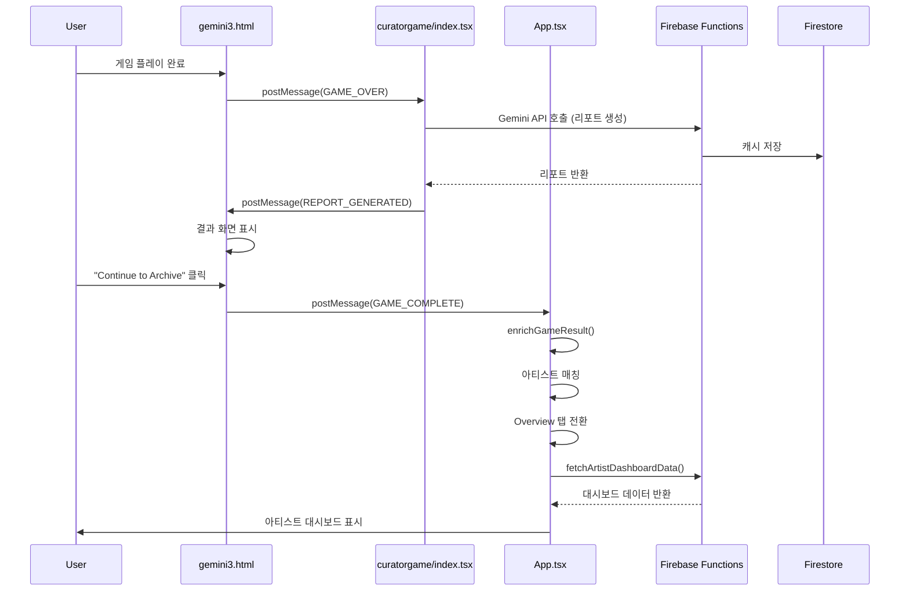
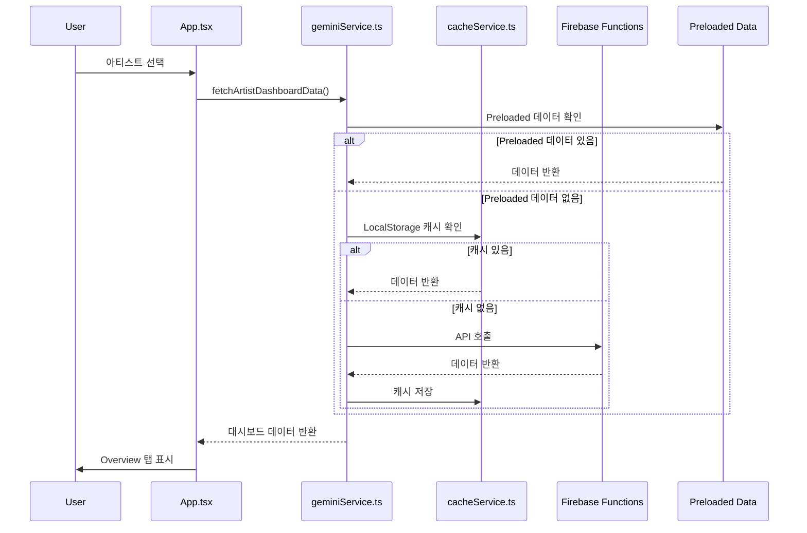
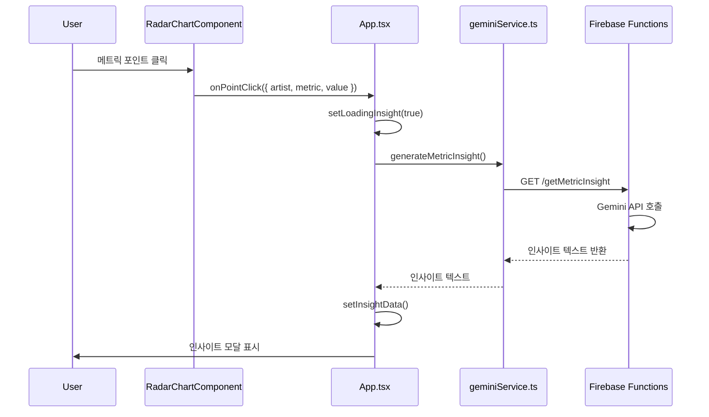
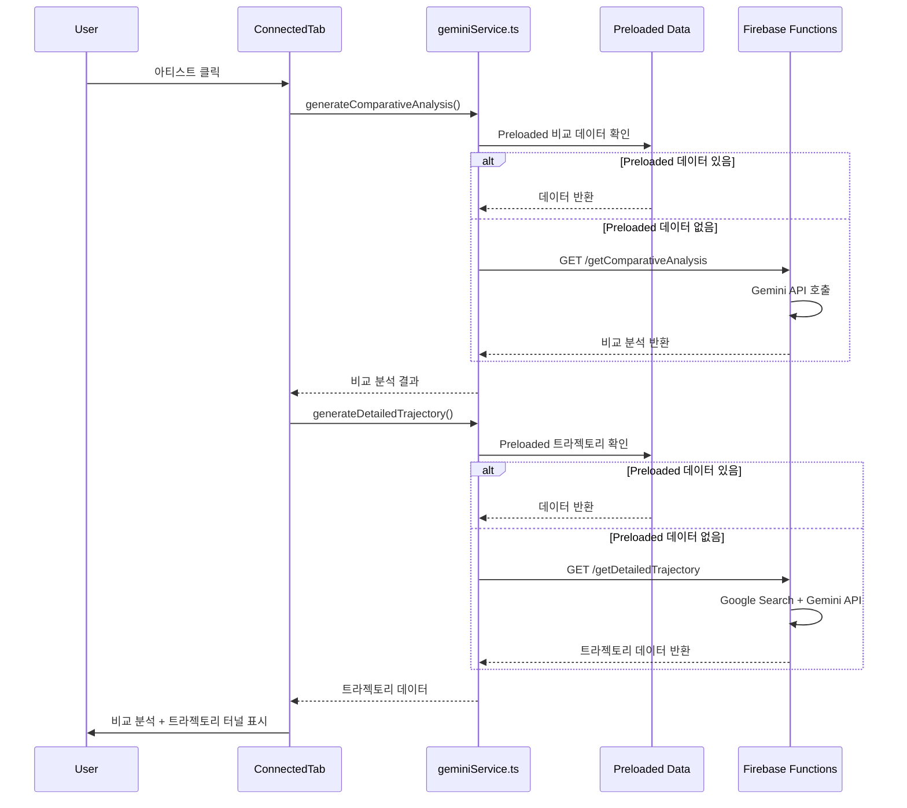

# Curator's Odysseia - 프로젝트 시스템 설계서 (PSD)

**버전**: 1.0  
**작성일**: 2024-12-11  
**최종 업데이트**: 2024-12-11  
**프로젝트명**: Curator's Odysseia  
**부제**: Data Driven Art Archive  
**문서 유형**: Project System Design Document (PSD)  
**상태**: 초기 작성 완료

---

## 목차

1. [프로젝트 개요](#1-프로젝트-개요)
2. [시스템 아키텍처](#2-시스템-아키텍처)
3. [게임-웹 통합 아키텍처](#3-게임-웹-통합-아키텍처)
4. [프론트엔드 상세](#4-프론트엔드-상세)
5. [백엔드 상세](#5-백엔드-상세)
6. [데이터 흐름 및 플로우](#6-데이터-흐름-및-플로우)
7. [기능 명세](#7-기능-명세)
8. [기술 스택 상세](#8-기술-스택-상세)
9. [배포 및 인프라](#9-배포-및-인프라)
10. [부록](#10-부록)

---

## 1. 프로젝트 개요

### 1.1 프로젝트 목적 및 범위

**Curator's Odysseia**는 데이터 기반 아트 아카이브 플랫폼으로, 다음과 같은 목적을 가집니다:

- **27명의 작가**에 대한 종합적인 큐레이토리얼 데이터 제공
- **AI 기반 분석**을 통한 작가 리포트, 타임라인, 비교 분석 생성
- **인터랙티브 3D 게임**을 통한 작가 매칭 및 탐색 경험 제공
- **시각화 차트**를 통한 메트릭 분석 (레이더 차트, 라인 차트, 트라젝토리 터널)

### 1.2 기술 스택 요약

#### 프론트엔드
- **React 19.2** - UI 프레임워크
- **TypeScript 5.8** - 타입 안정성
- **Vite 6.2** - 빌드 도구
- **Recharts** - 차트 라이브러리
- **Framer Motion** - 애니메이션
- **Tone.js** - 오디오 처리
- **Three.js** - 3D 게임 렌더링
- **MediaPipe** - 핸드 트래킹

#### 백엔드
- **Firebase Functions 2세대** - 서버리스 백엔드
- **Node.js 22** - 런타임 환경
- **Firestore** - 데이터베이스 (캐싱용)
- **Firebase Storage** - 이미지 스토리지
- **Google Gemini API** - AI 생성 (2.5 Flash, 3 Pro)
- **Google Custom Search API** - 이미지 검색

### 1.3 아키텍처 개요

```
┌─────────────────────────────────────────────────────────────┐
│                      사용자 브라우저                          │
├─────────────────────────────────────────────────────────────┤
│                                                               │
│  ┌──────────────────┐         ┌──────────────────┐         │
│  │   웹 앱 (React)  │◄───────►│  게임 (Three.js) │         │
│  │   App.tsx        │  iframe │  curatorgame/    │         │
│  └────────┬─────────┘         └──────────────────┘         │
│           │                                                   │
│           │ HTTP/HTTPS                                        │
│           ▼                                                   │
│  ┌─────────────────────────────────────────────────────┐   │
│  │         Firebase Functions (10개 엔드포인트)        │   │
│  │  ┌──────────────────────────────────────────────┐   │   │
│  │  │  Gemini API (2.5 Flash / 3 Pro)              │   │   │
│  │  │  Google Custom Search API                     │   │   │
│  │  │  Firebase Storage (이미지)                    │   │   │
│  │  └──────────────────────────────────────────────┘   │   │
│  └─────────────────────────────────────────────────────┘   │
│           │                                                   │
│           │                                                   │
│  ┌────────▼───────────────────────────────────────────┐     │
│  │         Firestore (캐싱)                           │     │
│  │         Firebase Storage (이미지)                  │     │
│  └───────────────────────────────────────────────────┘     │
│                                                               │
└─────────────────────────────────────────────────────────────┘
```

---

## 2. 시스템 아키텍처

### 2.1 전체 구조도

#### 디렉토리 구조

```
C:\CURATOR1203\
├── components/              # 13개 React 컴포넌트
│   ├── AccessibleChart.tsx
│   ├── AIReport.tsx
│   ├── ChartSkeleton.tsx
│   ├── ConnectedTab.tsx
│   ├── DeepDiveChat.tsx
│   ├── DeepDiveTab.tsx
│   ├── DualAreaChartComponent.tsx
│   ├── FlashlightGateway.tsx
│   ├── GameResultBanner.tsx
│   ├── LineChartComponent.tsx
│   ├── RadarChartComponent.tsx
│   ├── TimelineJourney.tsx
│   └── TrajectoryTunnel.tsx
├── services/                # 8개 서비스 레이어
│   ├── artistImageService.ts
│   ├── artistListService.ts
│   ├── audioService.ts
│   ├── cacheService.ts
│   ├── firebaseConfig.ts
│   ├── geminiService.ts
│   ├── preloadedDataService.ts
│   └── requestDeduplication.ts
├── curatorgame/             # 게임 서브모듈 (독립 React 앱)
│   ├── HandController.tsx
│   ├── index.tsx            # 게임 진입점
│   ├── index.html
│   └── init/
│       └── gemini3.html     # Three.js 게임
├── functions/               # Firebase Functions 백엔드
│   ├── src/
│   │   ├── index.ts        # 10개 엔드포인트 정의
│   │   └── utils/
│   │       ├── cache.ts
│   │       ├── googleSearch.ts
│   │       └── imageSearch.ts
├── hooks/                   # 커스텀 React 훅
│   ├── useIntersectionObserver.ts
│   └── useResponsive.ts
├── types/                   # TypeScript 타입 정의
│   └── PreloadedData.ts
├── utils/                   # 유틸리티 함수
│   └── gameUtils.ts
├── public/data/preloaded/   # 정적 데이터
│   ├── timelines/           # 28개 타임라인 JSON
│   ├── trajectories/        # 28개 트라젝토리 JSON
│   ├── comparisons/         # 301개 비교 분석 JSON
│   └── masterpieces/        # 대표작 데이터
├── App.tsx                  # 메인 앱 컴포넌트
├── index.tsx                # 진입점
└── types.ts                 # 공통 타입 정의
```

### 2.2 컴포넌트 계층 구조

```
App.tsx (메인 컨테이너)
│
├── LandingPage (랜딩 페이지)
│   └── 게임 iframe 임베딩
│
├── Overview Tab
│   ├── GameResultBanner (게임 결과 배너)
│   ├── RadarChartComponent (레이더 차트)
│   ├── LineChartComponent (라인 차트)
│   └── 모달들
│       ├── Insight Modal (메트릭 인사이트)
│       └── Masterpiece Carousel (대표작 캐러셀)
│
├── Deep Dive Tab (Lazy Loaded)
│   ├── FlashlightGateway (AI 리포트 타이핑 효과)
│   ├── DeepDiveChat (채팅 인터페이스)
│   └── TimelineJourney (타임라인 여정 시각화)
│
└── Connected Tab (Lazy Loaded)
    ├── Artist Cluster Visualization
    ├── TrajectoryTunnel (트라젝토리 터널)
    ├── DualAreaChartComponent (듀얼 영역 차트)
    └── Masterpiece Gallery
```

### 2.3 데이터 흐름도

#### 데이터 소스 우선순위

```
사용자 요청
    │
    ▼
┌─────────────────────────────────────┐
│ 1. Preloaded Data (정적 JSON)       │ ← 최우선
│    - /public/data/preloaded/       │
│    - 타임라인, 트라젝토리, 비교 분석 │
└──────────────┬──────────────────────┘
               │ (없으면)
               ▼
┌─────────────────────────────────────┐
│ 2. LocalStorage 캐시                │
│    - cacheService.ts                │
└──────────────┬──────────────────────┘
               │ (없으면)
               ▼
┌─────────────────────────────────────┐
│ 3. Firestore 캐시                   │
│    - Firebase Functions             │
└──────────────┬──────────────────────┘
               │ (없으면)
               ▼
┌─────────────────────────────────────┐
│ 4. Gemini API 호출                  │
│    - 실시간 AI 생성                  │
└─────────────────────────────────────┘
```

---

## 3. 게임-웹 통합 아키텍처

### 3.1 통합 방식

#### 게임 임베딩 구조

```typescript
// App.tsx에서 게임 로드
<iframe
  src="/curatorgame/"
  className="w-full h-full border-none bg-black"
  allow="camera; microphone"
/>
```

**게임 구조**:
1. **웹 앱 레벨**: `App.tsx` → iframe으로 `/curatorgame/` 로드
2. **게임 앱 레벨**: `curatorgame/index.tsx` → React 앱
3. **게임 엔진 레벨**: `curatorgame/init/gemini3.html` → Three.js HTML

```
App.tsx (웹 앱)
    │
    │ iframe src="/curatorgame/"
    ▼
curatorgame/index.tsx (게임 React 앱)
    │
    │ iframe srcDoc={gameHtml}
    ▼
gemini3.html (Three.js 게임)
```

### 3.2 통신 프로토콜

#### 메시지 타입 정의

```typescript
// 게임 → 웹 앱 (curatorgame/index.tsx → App.tsx)
interface GameMessage {
  type: 'GAME_COMPLETE' | 'GAME_SKIP';
  payload: GameResult | { artistName: string };
}

// 게임 내부 통신 (gemini3.html → curatorgame/index.tsx)
interface InternalGameMessage {
  type: 'GAME_OVER' | 'REPORT_GENERATED' | 'PAUSE_GAME' | 'INPUT_UPDATE';
  payload: any;
}
```

#### 메시지 플로우

```
┌─────────────────┐
│ gemini3.html    │
│ (Three.js)      │
└────────┬────────┘
         │ postMessage({ type: 'GAME_OVER', payload: gameData })
         ▼
┌─────────────────┐
│ curatorgame/    │
│ index.tsx       │
│ - AI 리포트 생성│
└────────┬────────┘
         │ postMessage({ type: 'REPORT_GENERATED', payload: report })
         │ (게임 내부 iframe으로)
         ▼
┌─────────────────┐
│ gemini3.html    │
│ - 결과 화면 표시│
└────────┬────────┘
         │ postMessage({ type: 'GAME_COMPLETE', payload: result })
         ▼
┌─────────────────┐
│ App.tsx         │
│ - 아티스트 매칭 │
│ - Overview 전환 │
└─────────────────┘
```

#### 주요 메시지 타입 상세

1. **GAME_OVER**
   - 발신: `gemini3.html` (게임 종료 시)
   - 수신: `curatorgame/index.tsx`
   - 처리: AI 리포트 생성 요청

2. **REPORT_GENERATED**
   - 발신: `curatorgame/index.tsx` (AI 리포트 생성 완료)
   - 수신: `gemini3.html`
   - 처리: 게임 결과 화면 표시

3. **GAME_COMPLETE**
   - 발신: `gemini3.html` ("Continue to Archive" 클릭)
   - 수신: `App.tsx` (최상위)
   - 처리: 아티스트 매칭 및 Overview 탭 전환

4. **GAME_SKIP**
   - 발신: `curatorgame/index.tsx` (스킵 버튼 클릭)
   - 수신: `App.tsx`
   - 처리: 랜덤 아티스트 선택 및 Overview 전환

5. **PAUSE_GAME**
   - 발신: `curatorgame/index.tsx` (모달 표시 시)
   - 수신: `gemini3.html`
   - 처리: 게임 일시정지/재개

6. **INPUT_UPDATE**
   - 발신: `HandController.tsx` (핸드 트래킹 입력)
   - 수신: `gemini3.html`
   - 처리: 게임 내 선박 조종

### 3.3 데이터 변환 및 매핑

#### 게임 Metrics → 웹 RadarData 변환

```typescript
// utils/gameUtils.ts
export function convertGameMetricsToRadarData(gameMetrics: GameMetrics): AxisData[] {
  return [
    { axis: 'Institutional', value: gameMetrics.inst, fullMark: 100 },
    { axis: 'Market Value', value: gameMetrics.net, fullMark: 100 },
    { axis: 'Critical Acclaim', value: gameMetrics.acad, fullMark: 100 },
    { axis: 'Historical', value: gameMetrics.hist, fullMark: 100 },
    { axis: 'Social Impact', value: gameMetrics.disc, fullMark: 100 },
  ];
}
```

**매핑 테이블**:

| 게임 Metrics | 웹 Axis | 설명 |
|-------------|---------|------|
| `inst` | Institutional | 제도권 인정도 |
| `net` | Market Value | 시장 가치 |
| `acad` | Critical Acclaim | 비평적 성과 |
| `hist` | Historical | 역사적 중요성 |
| `disc` | Social Impact | 사회적 영향력 |

#### 아티스트 매칭 알고리즘

```typescript
// utils/gameUtils.ts - enrichGameResult()
export function enrichGameResult(result: GameResult): GameResult {
  // 1. AI match로 ID 찾기 시도
  let matchedId = findArtistIdByName(result.match);
  
  // 2. 실패 시 Metrics 기반 유사도로 찾기
  if (!matchedId) {
    const similarArtist = findMostSimilarArtist(result.metrics);
    matchedId = similarArtist.id;
  }
  
  return {
    ...result,
    matchedArtistId: matchedId,
    timestamp: Date.now(),
  };
}
```

**매칭 우선순위**:
1. AI 반환 이름 정확 매칭 (`findArtistIdByName`)
2. 부분 매칭 (이름 포함 검색)
3. Metrics 유클리드 거리 기반 유사도 매칭 (`findMostSimilarArtist`)

---

## 4. 프론트엔드 상세

### 4.1 컴포넌트 구조

#### Overview Tab 컴포넌트

**위치**: `App.tsx` (라인 704-806)

**주요 기능**:
- 아티스트 대시보드 표시
- 레이더 차트 (단일/듀얼)
- 라인 차트 (트라젝토리)
- 메트릭 클릭 → 인사이트 모달
- 축 클릭 → 대표작 캐러셀
- 게임 결과 배너 표시

**데이터 흐름**:
```typescript
// App.tsx
useEffect(() => {
  if (activeView === AppView.OVERVIEW) {
    const data = await fetchArtistDashboardData(baseArtistInfo.name);
    setDashboardData(data);
  }
}, [selectedArtistId, activeView]);
```

#### Deep Dive Tab 컴포넌트

**위치**: `components/DeepDiveTab.tsx`

**주요 기능**:
- AI 리포트 생성 및 타이핑 효과 표시
- 타임라인 여정 시각화 (`TimelineJourney`)
- 채팅 인터페이스 (`DeepDiveChat`)
- 오디오 앰비언트 재생 (`audioService`)

**상태 머신**:
```typescript
type ViewState = 'FETCHING' | 'TYPING' | 'HUD_ACTIVE' | 'TIMELINE_ACTIVE';
```

#### Connected Tab 컴포넌트

**위치**: `components/ConnectedTab.tsx`

**주요 기능**:
- 아티스트 클러스터 시각화
- 비교 분석 생성 (`generateComparativeAnalysis`)
- 트라젝토리 터널 시각화 (`TrajectoryTunnel`)
- 대표작 갤러리
- 무한 스크롤 (동적 아티스트 로드)

**동적 아티스트 로드**:
```typescript
// Intersection Observer로 무한 스크롤 구현
useEffect(() => {
  observerRef.current = new IntersectionObserver(
    (entries) => {
      if (entries[0].isIntersecting && hasMoreArtists) {
        loadMoreArtists();
      }
    },
    { threshold: 0.1, rootMargin: '200px' }
  );
}, []);
```

### 4.2 상태 관리

#### 전역 상태 (App.tsx)

```typescript
// 뷰 상태
const [activeView, setActiveView] = useState<AppView>(AppView.LANDING);

// 선택된 아티스트
const [selectedArtistId, setSelectedArtistId] = useState<string>(MOCK_ARTISTS[0].id);

// 대시보드 데이터
const [dashboardData, setDashboardData] = useState<DashboardData | null>(null);

// 게임 결과
const [gameResult, setGameResult] = useState<GameResult | null>(null);

// 인사이트 모달
const [insightData, setInsightData] = useState<{ artist: string, metric: string, value: number, text: string } | null>(null);

// 대표작 캐러셀
const [carouselData, setCarouselData] = useState<{ metric: string; works: Masterpiece[] } | null>(null);
```

#### 로컬 상태 (컴포넌트별)

- **DeepDiveTab**: 리포트 데이터, 타임라인 데이터, 타이핑 상태
- **ConnectedTab**: 선택된 아티스트, 비교 분석 결과, 트라젝토리 데이터
- **게임**: 게임 HTML, 로딩 상태, 에러 상태

### 4.3 라우팅 및 네비게이션

#### 뷰 전환 로직

```typescript
enum AppView {
  LANDING = 'LANDING',
  OVERVIEW = 'OVERVIEW',
  CONNECTED = 'CONNECTED',
  DEEP_DIVE = 'DEEP_DIVE',
}
```

**네비게이션 플로우**:

```
LANDING (게임)
    │
    ├─→ [게임 완료] → OVERVIEW (매칭된 아티스트)
    │
    ├─→ [게임 스킵] → OVERVIEW (랜덤 아티스트)
    │
    └─→ [검색 입력] → OVERVIEW (검색된 아티스트)

OVERVIEW
    │
    ├─→ [탭 클릭] → DEEP_DIVE
    │
    └─→ [탭 클릭] → CONNECTED

CONNECTED
    │
    └─→ [아티스트 클릭] → DEEP_DIVE

DEEP_DIVE
    │
    └─→ [탭 클릭] → OVERVIEW / CONNECTED
```

### 4.4 서비스 레이어

#### geminiService.ts

**주요 함수**:
- `fetchArtistDashboardData()` - 대시보드 데이터
- `generateArtistReport()` - AI 리포트
- `generateArtistTimeline()` - 타임라인
- `generateMetricInsight()` - 메트릭 인사이트
- `fetchMasterpiecesByMetric()` - 메트릭별 대표작
- `generateComparativeAnalysis()` - 비교 분석
- `generateDetailedTrajectory()` - 상세 궤적
- `generateEventImage()` - 이벤트 이미지 생성
- `generateChatResponse()` - 채팅 응답

**캐싱 전략**:
```typescript
// 1. Preloaded 데이터 우선 확인
const preloadedTimeline = await loadArtistTimeline(artistName);
if (preloadedTimeline) return preloadedTimeline;

// 2. LocalStorage 캐시 확인
const cached = await getCached<TimelineData>('timeline', cacheKey);
if (cached) return cached;

// 3. API 호출
const response = await fetch(`${FUNCTIONS_URL}/getArtistTimeline?...`);
const data = await response.json();
await setCached('timeline', cacheKey, data);
return data;
```

#### cacheService.ts

**구현 방식**:
- LocalStorage 기반 캐싱
- Firestore 백업 캐싱 (서비스 레이어에서 처리)
- TTL 기반 만료 관리

#### requestDeduplication.ts

**중복 요청 방지**:
```typescript
const pendingRequests = new Map<string, Promise<any>>();

export function deduplicateRequest<T>(
  key: string,
  fn: () => Promise<T>
): Promise<T> {
  if (pendingRequests.has(key)) {
    return pendingRequests.get(key)!;
  }
  
  const promise = fn().finally(() => {
    pendingRequests.delete(key);
  });
  
  pendingRequests.set(key, promise);
  return promise;
}
```

---

## 5. 백엔드 상세

### 5.1 Firebase Functions 구조

**위치**: `functions/src/index.ts`

**함수 목록** (10개):

1. **getDashboardData** (라인 85-195)
   - 작가 대시보드 데이터 생성
   - 모델: `gemini-2.5-flash`
   - 응답: `DashboardData`

2. **getArtistReport** (라인 242-358)
   - 작가 리포트 생성 (Markdown)
   - 모델: `gemini-3-pro-preview`
   - 응답: `AIReportResult`

3. **getArtistTimeline** (라인 361-516)
   - 작가 타임라인 생성
   - 모델: `gemini-2.5-flash`
   - 타임아웃: 120초
   - 응답: `TimelineData`

4. **getMetricInsight** (라인 519-562)
   - 메트릭 인사이트 생성
   - 모델: `gemini-3-pro-preview`
   - 응답: `{ text: string }`

5. **getMasterpieces** (라인 565-657)
   - 메트릭별 대표작 목록
   - 모델: `gemini-2.5-flash`
   - 응답: `Masterpiece[]`

6. **getComparativeAnalysis** (라인 660-722)
   - 비교 분석 생성
   - 모델: `gemini-3-pro-preview`
   - 응답: `AIReportResult`

7. **getDetailedTrajectory** (라인 725-881)
   - 상세 궤적 데이터 생성
   - 모델: `gemini-2.5-flash`
   - 타임아웃: 300초 (5분)
   - 메모리: 512MiB
   - 응답: `ComparativeTrajectory`

8. **getArtistImage** (라인 884-921)
   - 작가 이미지 생성
   - 모델: `gemini-3-pro-image-preview`
   - 응답: `{ url: string }`

9. **getArtistList** (라인 924-1026)
   - 동적 작가 목록 생성
   - 모델: `gemini-2.5-flash`
   - 타임아웃: 120초
   - 응답: `{ artists: Artist[] }`

10. **getChatResponse** (라인 1029-1064)
    - 채팅 응답 생성
    - 모델: `gemini-3-pro-preview`
    - 캐싱 없음 (대화형)
    - 응답: `{ text: string }`

### 5.2 API 엔드포인트 명세

#### 공통 설정

```typescript
export const FUNCTIONS_URL = import.meta.env.VITE_FUNCTIONS_URL 
  || 'https://us-central1-curatorproto.cloudfunctions.net';
```

**CORS 설정**: 모든 함수에 `cors: true` 적용

**보안 헤더**:
```typescript
function setSecurityHeaders(res: any) {
  res.set({
    'X-Content-Type-Options': 'nosniff',
    'X-Frame-Options': 'DENY',
    'Access-Control-Allow-Origin': '*',
    'Access-Control-Allow-Methods': 'GET, POST, OPTIONS',
    'Access-Control-Allow-Headers': 'Content-Type'
  });
}
```

#### 엔드포인트 상세

**1. GET /getDashboardData**
- **쿼리 파라미터**: `artistName` (required)
- **응답**: `DashboardData`
- **캐싱**: Firestore (`dashboard:{artistName}`)

**2. GET /getArtistReport**
- **쿼리 파라미터**: `artistName` (required)
- **응답**: `AIReportResult`
- **캐싱**: Firestore (`report:{artistName}`)

**3. GET /getArtistTimeline**
- **쿼리 파라미터**: `artistName` (required), `birthYear` (required)
- **응답**: `TimelineData`
- **캐싱**: Firestore (`timeline:{artistName}:{birthYear}`)

**4. GET /getMetricInsight**
- **쿼리 파라미터**: `artistName`, `metric`, `score` (required)
- **응답**: `{ text: string }`
- **캐싱**: Firestore (`insight:{artistName}:{metric}:{score}`)

**5. GET /getMasterpieces**
- **쿼리 파라미터**: `artistName`, `metric` (required)
- **응답**: `Masterpiece[]`
- **캐싱**: Firestore (`masterpieces:{artistName}:{metric}`)

**6. GET /getComparativeAnalysis**
- **쿼리 파라미터**: `artist1`, `artist2` (required), `sharedMetric` (optional)
- **응답**: `AIReportResult`
- **캐싱**: Firestore (`comparison:{artist1}:{artist2}:{sharedMetric}`)

**7. GET /getDetailedTrajectory**
- **쿼리 파라미터**: `artist1`, `artist2` (required)
- **응답**: `ComparativeTrajectory`
- **캐싱**: Firestore (`trajectory:{artist1}:{artist2}`)
- **특수 처리**: Google Custom Search API 병렬 호출

**8. GET /getArtistImage**
- **쿼리 파라미터**: `prompt` (required)
- **응답**: `{ url: string }`
- **캐싱**: Firestore (`images:{prompt}`)

**9. GET /getArtistList**
- **쿼리 파라미터**: `offset` (default: 0), `limit` (default: 20), `context` (optional)
- **응답**: `{ artists: Artist[] }`
- **캐싱**: Firestore (`artist_list:{offset}:{limit}:{context}`)

**10. GET /getChatResponse**
- **쿼리 파라미터**: `artistName`, `topic` (required)
- **응답**: `{ text: string }`
- **캐싱**: 없음 (대화형)

### 5.3 데이터베이스 스키마

#### Firestore 컬렉션 구조

```
firestore/
├── dashboard/
│   └── {cacheKey}/
│       └── {data: DashboardData}
├── report/
│   └── {cacheKey}/
│       └── {data: AIReportResult}
├── timeline/
│   └── {cacheKey}/
│       └── {data: TimelineData}
├── insight/
│   └── {cacheKey}/
│       └── {data: string}
├── masterpieces/
│   └── {cacheKey}/
│       └── {data: Masterpiece[]}
├── comparison/
│   └── {cacheKey}/
│       └── {data: AIReportResult}
├── trajectory/
│   └── {cacheKey}/
│       └── {data: ComparativeTrajectory}
├── images/
│   └── {cacheKey}/
│       └── {data: string (URL)}
└── artists/
    └── {cacheKey}/
        └── {data: Artist[]}
```

**캐시 키 형식**:
- `dashboard:{artistName}`
- `report:{artistName}`
- `timeline:{artistName}:{birthYear}`
- `insight:{artistName}:{metric}:{score}`
- `masterpieces:{artistName}:{metric}`
- `comparison:{artist1}:{artist2}:{sharedMetric}`
- `trajectory:{artist1}:{artist2}` (정규화: 정렬된 이름)
- `image:{prompt}`
- `artist_list:{offset}:{limit}:{context}`

### 5.4 캐싱 전략

#### 다단계 캐싱

```
1. Preloaded Data (정적 JSON)
   └─→ /public/data/preloaded/
       ├─→ timelines/ (28개 파일)
       ├─→ trajectories/ (28개 파일)
       └─→ comparisons/ (301개 파일)

2. LocalStorage (브라우저)
   └─→ cacheService.ts
       └─→ TTL 기반 만료

3. Firestore (서버)
   └─→ functions/src/utils/cache.ts
       └─→ 영구 저장 (수동 삭제 전까지 유지)

4. API 호출 (최후 수단)
   └─→ Gemini API
       └─→ Google Custom Search API
```

#### 캐시 유틸리티

**프론트엔드** (`services/cacheService.ts`):
- LocalStorage 기반
- TTL 관리
- JSON 직렬화/역직렬화

**백엔드** (`functions/src/utils/cache.ts`):
- Firestore 기반
- 컬렉션별 분리
- 자동 만료 없음 (수동 관리)

---

## 6. 데이터 흐름 및 플로우

### 6.1 사용자 시나리오별 플로우차트

#### 시나리오 1: 게임 완료 → 아티스트 매칭



#### 시나리오 2: 아티스트 선택 → Overview 표시



#### 시나리오 3: 메트릭 클릭 → 인사이트 모달



#### 시나리오 4: Connected 탭에서 아티스트 선택 → 비교 분석



### 6.2 태스크 플로우

#### 게임 완료 플로우

```
1. 사용자 게임 플레이
   └─→ Three.js 게임 실행
   └─→ 핸드 트래킹 입력 수집
   └─→ 게임 메트릭 계산

2. 게임 종료
   └─→ GAME_OVER 메시지 전송
   └─→ curatorgame/index.tsx에서 AI 리포트 생성 요청

3. AI 리포트 생성
   └─→ Gemini 2.5 Flash API 호출
   └─→ 게임 데이터 기반 리포트 생성
   └─→ 27명 아티스트 중 매칭

4. 리포트 표시
   └─→ REPORT_GENERATED 메시지 전송
   └─→ 게임 내 결과 화면 표시

5. 아카이브 전환
   └─→ GAME_COMPLETE 메시지 전송
   └─→ App.tsx에서 아티스트 매칭
   └─→ LocalStorage에 게임 결과 저장
   └─→ Overview 탭으로 전환
   └─→ 매칭된 아티스트 대시보드 표시
```

#### 아티스트 탐색 플로우

```
1. 아티스트 선택
   └─→ 드롭다운에서 아티스트 선택
   └─→ selectedArtistId 상태 업데이트

2. 데이터 로드
   └─→ Preloaded 데이터 확인
   └─→ 캐시 확인
   └─→ API 호출 (필요 시)

3. 대시보드 표시
   └─→ 레이더 차트 렌더링
   └─→ 라인 차트 렌더링
   └─→ 아티스트 정보 표시

4. 인터랙션
   └─→ 메트릭 클릭 → 인사이트 모달
   └─→ 축 클릭 → 대표작 캐러셀
   └─→ 탭 전환 → Deep Dive / Connected
```

### 6.3 에러 처리 플로우

#### 에러 처리 계층

```
1. 네트워크 에러
   └─→ catch 블록에서 감지
   └─→ 폴백 데이터 반환 (Preloaded 또는 Mock)
   └─→ 사용자에게 에러 메시지 표시

2. API 에러
   └─→ response.ok 확인
   └─→ 에러 응답 파싱
   └─→ 폴백 데이터 반환

3. 파싱 에러
   └─→ JSON.parse() try-catch
   └─→ 정규식으로 JSON 추출 재시도
   └─→ 실패 시 빈 데이터 반환

4. 타임아웃 에러
   └─→ getDetailedTrajectory: 300초 타임아웃
   └─→ 타임아웃 시 폴백 데이터 반환
```

#### 폴백 전략

**대시보드 데이터**:
- API 실패 시 → Preloaded 데이터
- Preloaded 없음 → Mock 데이터 (MOCK_ARTISTS)

**타임라인 데이터**:
- API 실패 시 → Preloaded 타임라인
- Preloaded 없음 → 빈 타임라인 반환

**트라젝토리 데이터**:
- API 실패 시 → Preloaded 트라젝토리
- Preloaded 없음 → 랜덤 데이터 생성 (폴백)

**이미지**:
- Google Search 실패 → AI 생성 이미지
- AI 생성 실패 → Picsum Photos 플레이스홀더

---

## 7. 기능 명세

### 7.1 기능 목록

#### Overview 탭 기능

1. **아티스트 대시보드 표시**
   - 아티스트 정보 (이름, 국적, 출생년도)
   - 큐레이토리얼 노트
   - 글로벌 랭킹
   - 아티스트 이미지

2. **레이더 차트 (Valuation Matrix)**
   - 5개 메트릭 시각화
   - 포인트 클릭 → 인사이트 모달
   - 축 클릭 → 대표작 캐러셀

3. **라인 차트 (Trajectory Index)**
   - 2020-2024 트라젝토리 시각화
   - 시간에 따른 가치 변화

4. **게임 결과 배너**
   - 게임 완료 시 표시
   - 매칭된 아티스트 정보
   - "Explore Artist" 버튼
   - "Play Again" 버튼

#### Deep Dive 탭 기능

1. **AI 리포트 생성 및 표시**
   - Gemini 3 Pro로 리포트 생성
   - 타이핑 효과 (FlashlightGateway)
   - Markdown 렌더링

2. **타임라인 여정 시각화**
   - 4개 Era로 구분
   - 각 Era별 이벤트 표시
   - 오디오 앰비언트 재생

3. **채팅 인터페이스**
   - 아티스트별 주제별 대화
   - Gemini 3 Pro 기반 응답

#### Connected 탭 기능

1. **아티스트 클러스터 시각화**
   - 27명 기본 아티스트 + 동적 로드
   - 무한 스크롤
   - 아티스트 이미지 표시

2. **비교 분석 생성**
   - 두 아티스트 비교 분석
   - 공유 메트릭 기반 분석

3. **트라젝토리 터널 시각화**
   - 듀얼 아티스트 트라젝토리
   - 5개 메트릭 비교
   - 터널 형태 3D 시각화

4. **대표작 갤러리**
   - 메트릭별 대표작 표시
   - 이미지 갤러리

#### 게임 (Landing) 기능

1. **Three.js 기반 3D 게임**
   - Abyssal Void 테마
   - 선박 조종 게임
   - 3개 Era (20s, 40s, 60s)

2. **핸드 트래킹 제어**
   - MediaPipe 기반
   - 손 위치로 선박 조종

3. **AI 리포트 생성**
   - 게임 데이터 기반 리포트
   - 27명 아티스트 매칭

4. **아티스트 매칭**
   - 게임 메트릭 기반 매칭
   - 유클리드 거리 계산

### 7.2 기능별 상세 명세

#### 레이더 차트 인터랙션

**포인트 클릭**:
```typescript
const handlePointClick = async (data: { artist: string, metric: string, value: number }) => {
  setLoadingInsight(true);
  const text = await generateMetricInsight(data.artist, data.metric, data.value);
  setInsightData({ ...data, text });
  setLoadingInsight(false);
};
```

**축 클릭**:
```typescript
const handleAxisClick = async (axis: string) => {
  setLoadingCarousel(true);
  const works = await fetchMasterpiecesByMetric(baseArtistInfo.name, axis);
  setCarouselData({ metric: axis, works });
  setLoadingCarousel(false);
};
```

#### 타임라인 여정 시각화

**Era 구조**:
```typescript
interface TimelineEra {
  eraLabel: string;      // "Early Career", "Mid Career", etc.
  ageRange: string;      // "20s-30s"
  startYear: number;
  endYear: number;
  moodColor: string;     // "#555555"
  summary: string;
  events: TimelineEvent[];
}
```

**이벤트 타입**:
- `Masterpiece`: 대표작
- `Personal`: 개인적 사건
- `Scandal`: 스캔들
- `Exhibition`: 전시

#### 트라젝토리 터널 시각화

**데이터 포인트**:
```typescript
interface TrajectoryDataPoint {
  age: number;                    // 20, 22, 24, ..., 80
  a1_total: number;              // 아티스트 1 총합
  a1_institution: number;        // 제도권
  a1_discourse: number;          // 담론
  a1_academy: number;            // 학술
  a1_network: number;            // 네트워크
  a1_context?: string;           // 컨텍스트 (한국어)
  // 아티스트 2도 동일한 구조
}
```

**시각화 방식**:
- 터널 형태 3D 렌더링
- 두 아티스트의 궤적 비교
- 5개 메트릭별 색상 구분

### 7.3 비기능 요구사항

#### 성능 최적화

1. **Lazy Loading**
   - DeepDiveTab, ConnectedTab 지연 로드
   - `React.lazy()` 사용

2. **Code Splitting**
   - Vite 빌드 설정
   - 라이브러리별 청크 분리:
     - `react-vendor`: React, React-DOM
     - `charts`: Recharts
     - `animation`: Framer Motion
     - `markdown`: react-markdown
     - `audio`: Tone.js

3. **이미지 최적화**
   - Lazy loading
   - Placeholder 표시
   - Grayscale 필터

4. **캐싱 전략**
   - 다단계 캐싱 (Preloaded → LocalStorage → Firestore → API)
   - 요청 중복 방지 (`requestDeduplication`)

#### 접근성

1. **ARIA 레이블**
   - 차트 접근성 (`AccessibleChart.tsx`)
   - 키보드 네비게이션

2. **반응형 디자인**
   - 모바일/데스크톱 대응
   - `useResponsive` 훅 사용

3. **시맨틱 HTML**
   - 적절한 HTML 태그 사용
   - 시맨틱 구조

#### 에러 처리

1. **네트워크 에러**
   - 폴백 데이터 제공
   - 사용자 친화적 에러 메시지

2. **API 에러**
   - 재시도 로직
   - 타임아웃 처리

3. **파싱 에러**
   - JSON 추출 재시도
   - 정규식 기반 파싱

---

## 8. 기술 스택 상세

### 8.1 프론트엔드 기술

#### React 19.2

**주요 기능**:
- 함수형 컴포넌트
- Hooks (useState, useEffect, useRef, useCallback)
- Lazy Loading (`React.lazy`, `Suspense`)

**최적화**:
- `React.StrictMode` 활성화
- 메모이제이션 (`useCallback`, `useMemo`)

#### TypeScript 5.8

**타입 정의**:
- `types.ts`: 공통 타입
- `types/PreloadedData.ts`: Preloaded 데이터 타입
- 엄격한 타입 체크

#### Vite 6.2

**빌드 설정**:
```typescript
// vite.config.ts
build: {
  rollupOptions: {
    manualChunks: {
      'react-vendor': ['react', 'react-dom'],
      'charts': ['recharts'],
      'animation': ['framer-motion'],
      'markdown': ['react-markdown'],
      'audio': ['tone'],
    }
  }
}
```

**환경 변수**:
- `VITE_GEMINI_API_KEY`
- `VITE_FUNCTIONS_URL`

#### Recharts

**사용 컴포넌트**:
- `RadarChartComponent`: 레이더 차트
- `LineChartComponent`: 라인 차트
- `DualAreaChartComponent`: 듀얼 영역 차트

#### Framer Motion

**애니메이션**:
- 페이지 전환 효과
- 컴포넌트 페이드 인
- 인터랙션 애니메이션

#### Tone.js

**오디오 처리**:
- 앰비언트 사운드 재생
- 메트릭 기반 오디오 생성
- `audioService.ts`에서 관리

#### Three.js

**게임 엔진**:
- WebGL 렌더링
- 3D 그래픽스
- 물리 엔진 (부력, 드래그)

#### MediaPipe

**핸드 트래킹**:
- 웹캠 기반 손 인식
- 실시간 위치 추적
- `HandController.tsx`에서 구현

### 8.2 백엔드 기술

#### Firebase Functions 2세대

**설정**:
- Node.js 22
- TypeScript 컴파일
- CORS 자동 처리

**함수 설정 예시**:
```typescript
export const getDetailedTrajectory = onRequest({ 
  secrets: [geminiApiKeySecret, googleCseApiKeySecret, googleCseIdSecret],
  cors: true,
  timeoutSeconds: 300,
  memory: "512MiB",
  maxInstances: 10
}, async (req, res) => {
  // 함수 구현
});
```

#### Google Gemini API

**모델 사용**:
- `gemini-2.5-flash`: 빠른 응답 (대시보드, 타임라인, 트라젝토리)
- `gemini-3-pro-preview`: 고품질 응답 (리포트, 인사이트, 비교 분석)
- `gemini-3-pro-image-preview`: 이미지 생성

**도구 사용**:
- `googleSearch`: 웹 검색 (Grounding)
- `generateImages`: 이미지 생성

#### Google Custom Search API

**이미지 검색**:
- 작가 이미지 검색
- 작품 이미지 검색
- Wikipedia, 미술관 사이트 우선 검색

#### Firestore

**사용 목적**:
- API 응답 캐싱
- 영구 저장 (수동 삭제 전까지 유지)

**컬렉션 구조**:
- 컬렉션별 분리 (dashboard, report, timeline, etc.)
- 문서 ID = 캐시 키

#### Firebase Storage

**이미지 저장**:
- Gemini로 생성된 이미지 저장
- Signed URL 생성
- 장기 보관 (만료: 2500년)

### 8.3 외부 서비스 통합

#### Google Custom Search Engine (CSE)

**설정**:
- API Key: `GOOGLE_CSE_API_KEY`
- Engine ID: `GOOGLE_CSE_ID`
- 검색 대상: Wikipedia, 미술관 사이트

**사용 함수**:
- `searchArtistImage()`: 작가 이미지 검색
- `searchArtworkImage()`: 작품 이미지 검색

---

## 9. 배포 및 인프라

### 9.1 빌드 프로세스

#### 프론트엔드 빌드

```bash
# 개발 서버
npm run dev

# 프로덕션 빌드
npm run build

# 게임 파일 복사 (빌드 후)
npm run copy:game-files
```

**빌드 출력**:
- `dist/`: 빌드된 파일
- `dist/curatorgame/`: 게임 파일 복사본
- `dist/data/preloaded/`: Preloaded 데이터 복사본

#### 백엔드 빌드

```bash
# TypeScript 컴파일
cd functions
npm run build

# 로컬 테스트
npm run serve

# 배포
npm run deploy
```

### 9.2 배포 전략

#### Firebase Hosting (프론트엔드)

**설정 파일**: `firebase.json`

```json
{
  "hosting": {
    "public": "dist",
    "ignore": ["firebase.json", "**/.*", "**/node_modules/**"],
    "rewrites": [
      {
        "source": "**",
        "destination": "/index.html"
      }
    ]
  }
}
```

**배포 명령**:
```bash
firebase deploy --only hosting
```

#### Firebase Functions (백엔드)

**배포 명령**:
```bash
firebase deploy --only functions
```

**시크릿 관리**:
```bash
# 시크릿 설정
firebase functions:secrets:set GEMINI_API_KEY
firebase functions:secrets:set GOOGLE_CSE_API_KEY
firebase functions:secrets:set GOOGLE_CSE_ID
```

### 9.3 환경 변수 관리

#### 프론트엔드 환경 변수

**파일**: `.env` (로컬), Firebase Hosting 환경 변수 (프로덕션)

```
VITE_GEMINI_API_KEY=your_api_key
VITE_FUNCTIONS_URL=https://us-central1-curatorproto.cloudfunctions.net
```

**사용 위치**:
- `vite.config.ts`: 빌드 시 주입
- `services/geminiService.ts`: API URL
- `curatorgame/index.tsx`: 게임 내 API 키

#### 백엔드 환경 변수

**시크릿 관리**:
- Firebase Secret Manager 사용
- `defineSecret()` 함수로 정의
- `secret.value()` 함수로 접근

**로컬 개발**:
- `.env.curatorproto` 파일 사용
- `process.env`로 접근

---

## 10. 부록

### 10.1 파일 구조 트리

```
C:\CURATOR1203\
├── components/                    # 13개 컴포넌트
│   ├── AccessibleChart.tsx
│   ├── AIReport.tsx
│   ├── ChartSkeleton.tsx
│   ├── ConnectedTab.tsx
│   ├── DeepDiveChat.tsx
│   ├── DeepDiveTab.tsx
│   ├── DualAreaChartComponent.tsx
│   ├── FlashlightGateway.tsx
│   ├── GameResultBanner.tsx
│   ├── LineChartComponent.tsx
│   ├── RadarChartComponent.tsx
│   ├── TimelineJourney.tsx
│   └── TrajectoryTunnel.tsx
├── services/                       # 8개 서비스
│   ├── artistImageService.ts
│   ├── artistListService.ts
│   ├── audioService.ts
│   ├── cacheService.ts
│   ├── firebaseConfig.ts
│   ├── geminiService.ts
│   ├── preloadedDataService.ts
│   └── requestDeduplication.ts
├── curatorgame/                    # 게임 서브모듈
│   ├── HandController.tsx
│   ├── index.tsx
│   ├── index.html
│   ├── index.css
│   ├── package.json
│   ├── tsconfig.json
│   ├── vite.config.ts
│   └── init/
│       └── gemini3.html           # Three.js 게임
├── functions/                      # Firebase Functions
│   ├── src/
│   │   ├── index.ts               # 10개 엔드포인트
│   │   └── utils/
│   │       ├── cache.ts
│   │       ├── googleSearch.ts
│   │       └── imageSearch.ts
│   ├── package.json
│   └── tsconfig.json
├── hooks/                          # 커스텀 훅
│   ├── useIntersectionObserver.ts
│   └── useResponsive.ts
├── types/                          # 타입 정의
│   └── PreloadedData.ts
├── utils/                          # 유틸리티
│   └── gameUtils.ts
├── public/
│   └── data/
│       └── preloaded/             # 정적 데이터
│           ├── timelines/         # 28개 파일
│           ├── trajectories/      # 28개 파일
│           ├── comparisons/       # 301개 파일
│           ├── masterpieces/
│           └── index.json
├── docs/                           # 문서
│   ├── BRD.md
│   ├── SRD.md
│   ├── TSD.md
│   ├── ENDPOINT_AUDIT_REPORT.md
│   └── 1211psd.md                 # 본 문서
├── App.tsx                         # 메인 앱
├── index.tsx                       # 진입점
├── types.ts                        # 공통 타입
├── constants.ts                    # 상수
├── package.json
├── vite.config.ts
├── tsconfig.json
└── firebase.json
```

### 10.2 주요 타입 정의

#### 공통 타입 (`types.ts`)

```typescript
// 아티스트
interface Artist {
  id: string;
  name: string;
  birthYear: number;
  nationality: string;
  currentRank: number;
  radarData: AxisData[];
  trajectory: TimeSeriesPoint[];
  description: string;
  imageUrl: string;
}

// 게임 결과
interface GameResult {
  metrics: GameMetrics;
  timeline: GameTimelineEvent[];
  artifacts: GameArtifacts;
  score: number;
  archetype: string;
  match: string;
  narrative: string;
  matchedArtistId?: string;
  timestamp?: number;
}

// 대시보드 데이터
interface DashboardData {
  name: string;
  nationality: string;
  birthYear: number;
  description: string;
  imageUrl: string;
  radarData: AxisData[];
  trajectory: TimeSeriesPoint[];
  rank: number;
}

// AI 리포트 결과
interface AIReportResult {
  highlights?: ReportHighlights;
  text: string;
  sources: GroundingSource[];
}

// 타임라인 데이터
interface TimelineData {
  eras: TimelineEra[];
  critiques?: CriticalQuote[];
  masterpieces?: Masterpiece[];
  sources?: string[];
}

// 비교 궤적
interface ComparativeTrajectory {
  artist1: string;
  artist2: string;
  data: TrajectoryDataPoint[];
}
```

### 10.3 참고 문서

1. **BRD.md** - 비즈니스 요구사항 문서
2. **SRD.md** - 시스템 요구사항 문서
3. **TSD.md** - 기술 명세 문서
4. **ENDPOINT_AUDIT_REPORT.md** - 엔드포인트 정합성 점검 보고서

### 10.4 주요 상수

#### 아티스트 목록 (27명)

```typescript
export const MOCK_ARTISTS: Artist[] = [
  // 27명의 아티스트 데이터
  // constants.ts 참조
];
```

#### 메트릭 매핑

```typescript
export const METRIC_DETAILS: Record<string, { description: string; context: string }> = {
  'Market Value': { ... },
  'Critical Acclaim': { ... },
  'Historical': { ... },
  'Social Impact': { ... },
  'Institutional': { ... },
};
```

#### 색상 팔레트

```typescript
export const COLORS = {
  primary: '#28317C',      // Deep Royal Blue
  secondary: '#ffffff',    // White
  comparison: '#3B82F6',   // Azure Blue
  // ...
};
```

---

## 문서 변경 이력

| 버전 | 날짜 | 변경 내용 | 작성자 |
|------|------|----------|--------|
| 1.0 | 2024-12-11 | 초기 작성 완료 | AI Assistant |

---

## 검증 완료 체크리스트

- [x] 모든 컴포넌트가 문서에 포함되었는가? (13개 컴포넌트)
- [x] 모든 API 엔드포인트가 문서화되었는가? (10개 엔드포인트)
- [x] 게임-웹 통신 프로토콜이 명확히 설명되었는가? (6개 메시지 타입)
- [x] 데이터 흐름이 모든 시나리오에서 추적 가능한가? (4개 시나리오)
- [x] 기술 스택이 정확히 나열되었는가? (프론트엔드 8개, 백엔드 5개)
- [x] 배포 프로세스가 명확히 설명되었는가? (Firebase Hosting + Functions)

---

**문서 종료**

