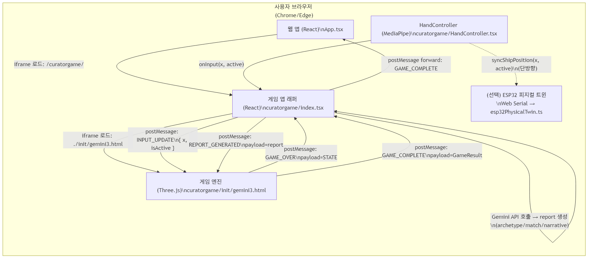
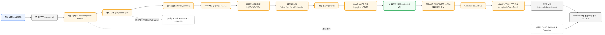

# Curator's Odysseia - 게임 웹 ↔ 웹 앱 최종 통합 설명서

**버전**: 1.1  
**작성일**: 2024-12-11  
**최종 업데이트**: 2025-12-12  
**상태**: 검증 완료(코드베이스 기준)  
**대상 범위**: 게임 웹(`curatorgame`) + 기존 웹 앱(루트 `App.tsx`) + (선택) ESP32 피지컬 트윈

---

## 목차

0. [한눈에 보기(요약표)](#0-한눈에-보기요약표)
1. [시스템 개요](#1-시스템-개요)
2. [핸드 트래킹 시스템](#2-핸드-트래킹-시스템)
3. [게임 웹 규칙 및 메커니즘](#3-게임-웹-규칙-및-메커니즘)
4. [게이트 시스템](#4-게이트-시스템)
5. [메트릭스 계산 및 아티팩트 수집](#5-메트릭스-계산-및-아티팩트-수집)
6. [게임 완료 후 플로우](#6-게임-완료-후-플로우)
7. [아티스트 매칭 알고리즘](#7-아티스트-매칭-알고리즘)
8. [Overview 탭 전환](#8-overview-탭-전환)
9. [메시지/데이터 스키마(프로토콜)](#9-메시지데이터-스키마프로토콜)
10. [참조 관계(의존성 맵)](#10-참조-관계의존성-맵)
11. [운영/트러블슈팅 체크리스트](#11-운영트러블슈팅-체크리스트)
12. [용어집(Glossary)](#12-용어집glossary)
13. [부록(Appendix)](#13-부록appendix)

---

## 0. 한눈에 보기(요약표)

> 이 문서는 “게임 웹 → AI 리포트 → 웹 앱 Overview”로 이어지는 **결정 규칙(맵핑/임계값/폴백)**을 코드 기준으로 정리한 최종 설명서입니다.
> 작품명/용어의 어원(예: Chronos Gate)은 주석으로 부연합니다.[^chronos][^odysseia]

### 0.1 사용자 여정(관람객 관점) 8-Step

| Step | 사용자가 보는 것 | 시스템에서 실제로 일어나는 일(핵심 규칙) | 결과 데이터 |
|---:|---|---|---|
| 1 | 랜딩에서 게임 시작 | `App.tsx`가 `/curatorgame/` iframe을 로드 | - |
| 2 | 손을 좌우로 움직여 항해 | MediaPipe → `normalizedInput ∈ [-1,1]` 계산 | `{x, active}` |
| 3 | 화면 속 오브젝트 수집 | 아티팩트 충돌 시 `score/metrics/artifacts` 누적 | `STATE.*` |
| 4 | Gate(문) 선택/통과 | Era별 3개 Gate 중 1개를 “지나가며” 선택 | `timeline[]` + `metricsΔ` |
| 5 | 20s→40s→60s 진행 | Gate 통과마다 `era++`, 3회 통과 후 종료 | `era=3` |
| 6 | 결과 화면/리포트 표시 | `GAME_OVER` → Gemini → `REPORT_GENERATED` | `{archetype, match, narrative}` |
| 7 | “Archive로 이동” | `GAME_COMPLETE` 전송(게임 결과 + 리포트 합성) | `GameResult` |
| 8 | Overview로 전환 | 웹 앱이 `enrichGameResult()`로 `matchedArtistId` 보강 후 `Overview` 로드 | `matchedArtistId` + 대시보드 |

### 0.2 핵심 맵핑 “3종 세트”(입력/게임/웹)

| 범주 | 원천 | 출력/맵핑 | 규칙(요약) |
|---|---|---|---|
| 입력 맵핑 | `landmarks[9].x` | `normalizedInput = ( (1 - x) - 0.5 ) * 2` | -1(좌)~+1(우) 정규화 |
| 게임 누적 | 아티팩트/게이트 | `STATE.metrics` / `STATE.timeline` / `STATE.artifacts` | 수집/선택 결과가 커리어 데이터로 저장 |
| 웹 매칭 | `GameResult.metrics + match` | `matchedArtistId` | 이름 매칭 실패 시 **유클리드 거리 최소** 작가로 폴백 |

### 0.3 확정 파라미터 빠른표(“바꿀 때 영향 범위”)

| 그룹 | 파라미터 | 현재값 | 영향 | 참조(코드) |
|---|---|---:|---|---|
| 조작감 | `HAND_SENSITIVITY` | 6.0 | 손 감지 시 좌우 반응 속도 | `gemini3.html` animate |
| 조작감 | `targetVel` | `input * 25` | 손 감지 시 목표 횡속도 | `gemini3.html` animate |
| 조작감 | `INPUT_FORCE` | 80.0 | 키/터치 기반 조작 힘 | `gemini3.html` animate |
| 물리 | `SHIP_MASS` | 2.0 | 가속도 스케일 | `gemini3.html` animate |
| 물리 | `WATER_DRAG` | 2.5 | 안정성/감쇠 | `gemini3.html` animate |
| 아티팩트 | T1 확률 | 5% | inst 성장/연출 강도 | `spawnObject('art')` |
| 아티팩트 | T2 확률 | 25% | net 성장/왜곡 | `spawnObject('art')` |
| 아티팩트 | T3 확률 | 70% | acad 성장 | `spawnObject('art')` |
| 게이트 | 슬로모션 | `dist<30`→`timeScale=0.1` | Gate 연출/스폰율 감소 | `gemini3.html` animate |
| 피지컬 | Serial 전송 주기 | 16ms | 반응 지연/부하 | `esp32PhysicalTwin.ts` |

---

## 1. 시스템 개요

### 1.1 전체 아키텍처



### 1.1.1 구성 요소 표(Where/What/How)

| 레이어 | 구성 요소 | 위치(파일) | 역할 | 통신(입력/출력) |
|---|---|---|---|---|
| 웹 앱 | App (React) | `App.tsx` | 게임 iframe 로드, `GAME_COMPLETE` 처리, Overview 전환 | `postMessage` 수신 |
| 게임 앱 | Game Wrapper (React) | `curatorgame/index.tsx` | 게임 엔진 iframe 로드, `GAME_OVER` 수신→Gemini 호출→`REPORT_GENERATED` 송신, `GAME_COMPLETE` forward | `postMessage` 송·수신 |
| 게임 엔진 | Three.js Game | `curatorgame/init/gemini3.html` | 항해/수집/게이트/종료 로직, `STATE` 생성, `GAME_OVER`/`GAME_COMPLETE` 송신 | `postMessage` 송·수신 |
| 입력 | HandController (MediaPipe) | `curatorgame/HandController.tsx` | 손 좌우 입력(`normalizedInput`) 계산 및 전달 | `onInput(x, active)` 호출 |
| (선택) 피지컬 | ESP32 Physical Twin | `curatorgame/services/esp32PhysicalTwin.ts` | 웹 입력을 ESP32로 단방향 전송(서보/LED) | Web Serial write |

**참조 파일**:
- `App.tsx`: 메인 웹 앱 진입점
- `curatorgame/index.tsx`: 게임 앱 래퍼
- `curatorgame/init/gemini3.html`: Three.js 게임 엔진
- `curatorgame/HandController.tsx`: 핸드 트래킹 컴포넌트

### 1.2 데이터 흐름 개요



#### 1.2.1 태스크 플로우 요약표(사용자 관점)

| 구간 | 사용자가 하는 행동 | 시스템 이벤트/메시지 | 누적/결과 |
|---|---|---|---|
| 조작 | 손 좌우 이동 | `INPUT_UPDATE` | `STATE.input`, `STATE.handActive` |
| 수집 | 오브젝트 획득 | (엔진 내부) | `score`, `metrics`, `artifacts` 증가 |
| 선택 | Gate 통과 | (엔진 내부) | `timeline` 기록 + `metricsΔ` 적용 |
| 종료 | 3회 Era 통과 | `GAME_OVER` | `STATE` 확정 |
| 해석 | 결과 기다림 | `REPORT_GENERATED` | `archetype/match/narrative` |
| 전환 | Archive로 이동 | `GAME_COMPLETE` | 웹 앱에서 `matchedArtistId` 보강 |

### 1.3 최종 결과물이 무엇인가?

- **게임 내부 결과물**: `metrics + timeline + artifacts + score`에 기반해 생성되는 `archetype/match/narrative` 리포트(게임 결과 화면에 표시)
- **웹 앱 내부 결과물**: `matchedArtistId`가 보강된 `GameResult` 저장(LocalStorage) + **Overview 탭으로 즉시 전환**
- **(선택) 피지컬 트윈**: 화면의 좌우 조작(=손 입력)을 그대로 반영하는 서보/LED 반응(단방향 Web Serial)

---

## 2. 핸드 트래킹 시스템

### 2.1 MediaPipe 통합

**파일**: `curatorgame/HandController.tsx`

**주요 로직**:
```typescript
// 라인 212-213: normalizedInput 계산
const rawX = 1 - landmarks[9].x; // Mirror & use middle finger MCP
const normalizedInput = (rawX - 0.5) * 2; // -1.0 ~ 1.0 범위로 정규화
```

**설명**:
- `landmarks[9]`: 중지 손가락 MCP (Metacarpophalangeal) 관절 위치 사용
- `rawX`: 0.0 ~ 1.0 범위 (화면 좌측=0, 우측=1)
- `normalizedInput`: -1.0 (왼쪽) ~ 0.0 (중앙) ~ +1.0 (오른쪽)

### 2.1.1 입력의 의미(게임/피지컬 공통)

- **x = -1.0**: 화면 기준 강한 좌측 입력
- **x = 0.0**: 중앙/중립
- **x = +1.0**: 화면 기준 강한 우측 입력
- **active = false**: 손이 감지되지 않은 상태(게임은 키/터치 등 다른 입력이 있을 수 있음, 피지컬 트윈은 중립값 전송)

### 2.2 입력 전달 경로

**1단계: 게임으로 전달**
```typescript
// HandController.tsx 라인 216
onInput(normalizedInput, true); // 게임 입력 콜백 호출
```

**2단계: 게임 앱에서 게임 엔진으로 전달**
```typescript
// curatorgame/index.tsx 라인 488-490
const handleHandInput = useCallback((x: number, isActive: boolean) => {
  iframeRef.current.contentWindow.postMessage(
    { type: 'INPUT_UPDATE', payload: { x, isActive } }, 
    '*'
  );
}, []);
```

**3단계: 게임 엔진에서 처리**
```javascript
// gemini3.html 라인 515
if(e.data.type==='INPUT_UPDATE') { 
  STATE.handActive = e.data.payload.isActive; 
  if(e.data.payload.isActive) STATE.input = e.data.payload.x; 
}
```

#### 2.2.1 중요 규칙: `handActive`가 물리(조작감)를 바꾼다

게임 엔진은 `STATE.handActive`에 따라 **입력 힘 계산 방식 자체**가 달라집니다(=손이 감지될 때 더 “속도 추종형” 조작).

- `handActive = true`: 목표 속도(targetVel)를 따라가도록 힘(force)을 계산(민감/즉각 반응)
- `handActive = false`: 입력값을 단순 힘으로 적용(키/터치 대비)

**참조 파일**:
- `curatorgame/HandController.tsx`: 라인 208-258
- `curatorgame/index.tsx`: 라인 487-491
- `curatorgame/init/gemini3.html`: 라인 515

### 2.3 ESP32 피지컬 트윈 연동 (선택 사항)

**파일**: `curatorgame/services/esp32PhysicalTwin.ts`

**연동 로직**:
```typescript
// HandController.tsx 라인 220-227
if (esp32PhysicalTwin.connected) {
  esp32PhysicalTwin.syncShipPosition(normalizedInput, true);
}
```

**참조 문서**: `docs/ESP32_PHYSICAL_TWIN_SPEC.md`

> Phase 1 정의: MPU‑6050은 **물리적으로만 연결**되어 있으며, 펌웨어/웹 로직에서 **사용하지 않음(Reserved)**.

---

## 3. 게임 웹 규칙 및 메커니즘

### 3.1 게임 상태 (STATE)

**파일**: `curatorgame/init/gemini3.html` 라인 270-275

```javascript
const STATE = { 
  running: true,           // 게임 실행 중
  paused: false,          // 일시정지 상태
  score: 0,               // 총 점수
  era: 0,                 // 현재 시대 (0=20s, 1=40s, 2=60s)
  speed: 30,              // 배 이동 속도
  dist: 0,                // 이동 거리
  vel: new THREE.Vector2(0,0), // 배 속도 벡터
  input: 0,               // 입력값 (-1.0 ~ 1.0)
  metrics: {              // 5축 메트릭스
    inst: 0,              // Institutional (제도권)
    net: 0,               // Network (시장)
    acad: 0,              // Academic (학술)
    disc: 0,              // Discourse (담론)
    hist: 0               // Historical (역사)
  },
  artifacts: {            // 수집한 아티팩트
    t1: 0,                // Tier 1 (Masterpieces)
    t2: 0,                // Tier 2 (Commercial Works)
    t3: 0                 // Tier 3 (Sketches)
  },
  timeline: [],           // 타임라인 이벤트
  handActive: false       // 손 감지 상태
};
```

### 3.3 게임 물리/조작 파라미터(확정값)

**파일**: `curatorgame/init/gemini3.html` (animate 루프 내부 상수)

| 항목 | 값 | 의미 |
|---|---:|---|
| `SHIP_MASS` | 2.0 | 질량(가속도 = 힘/질량) |
| `WATER_DRAG` | 2.5 | 기본 수면 저항 |
| `INPUT_FORCE` | 80.0 | 손 미감지(키/터치)일 때 입력 힘 스케일 |
| `HAND_SENSITIVITY` | 6.0 | 손 감지 시 목표 속도 추종 감도 |
| `targetVel` | `STATE.input * 25.0` | 손 감지 시 목표 횡속도 |
| X 클램프 | -25 ~ +25 | 좌우 이동 한계 |

**힘/가속도 계산 규칙(요약)**:
- `handActive=true`이면 \(force = (targetVel - vel.x) * HAND\_SENSITIVITY\)
- `handActive=false`이면 \(force = input * INPUT\_FORCE\)
- 여기에 드래그가 추가로 차감됨: \(force -= vel.x * dragCoeff\)

### 3.2 Era 시스템

**파일**: `curatorgame/init/gemini3.html` 라인 276

```javascript
const ERAS = ['20s', '40s', '60s'];
const SUB_ERAS = ['The Order', 'The Inquiry', 'The Ripple'];
```

**진행 방식**:
- 게임 시작: Era 0 (20s - The Order)
- 게이트 통과 시 Era 증가
- Era 3 도달 시 게임 종료

**참조**: `gemini3.html` 라인 357-359

---

## 4. 게이트 시스템

### 4.1 게이트 데이터베이스

**파일**: `curatorgame/init/gemini3.html` 라인 188-204

#### Era 20s (초기 경력)
```javascript
'20s': [
  { 
    id: 'ELITE', 
    label: 'THE ELITE', 
    type: 'Pos',  // 긍정적 게이트
    quote: '"Every child is an artist..."',
    w: {inst: 20}  // Institutional +20
  },
  { 
    id: 'EXPELLED', 
    label: 'EXPULSION', 
    type: 'Neg',  // 부정적 게이트
    quote: '"I am the master of my fate..."',
    w: {inst: -20, disc: 20}  // Institutional -20, Discourse +20
  },
  { 
    id: 'HIATUS', 
    label: 'HIATUS', 
    type: 'Neu',  // 중립 게이트
    quote: '"Life can only be understood backwards..."',
    w: {hist: 10}  // Historical +10
  }
]
```

#### Era 40s (중기 발전)
```javascript
'40s': [
  { id: 'THEORY', label: 'THEORY', type: 'Pos', w: {acad: 25} },
  { id: 'BETRAYAL', label: 'BETRAYAL', type: 'Neg', w: {acad: -10, disc: 15} },
  { id: 'WANDER', label: 'WANDERLUST', type: 'Neu', w: {hist: 20} }
]
```

#### Era 60s (후기 성과)
```javascript
'60s': [
  { id: 'RETRO', label: 'RETROSPECTIVE', type: 'Pos', w: {inst: 30, disc: 20} },
  { id: 'SCANDAL', label: 'SCANDAL', type: 'Neg', w: {disc: 40, net: -20} },
  { id: 'HERMIT', label: 'THE HERMIT', type: 'Neu', w: {hist: 40, net: -10} }
]
```

### 4.2 게이트 트리거 조건

**파일**: `curatorgame/init/gemini3.html` 라인 484, 489

**스폰 조건**:
```javascript
// 라인 484: 게이트 스폰 조건
if(STATE.dist%300>290 && 
   objects.filter(o=>o.userData.type=='gate').length===0 && 
   STATE.era<3) {
  spawnObject('gate', -120);
}
```

**트리거 조건**:
```javascript
// 라인 489: 게이트 충돌 감지
if(o.userData.type==='gate') { 
  if(Math.abs(o.position.z-player.position.z)<2 && 
     Math.abs(o.position.x-player.position.x)<6.0) {
    triggerGateSequence(o.userData.data); 
    return; 
  } 
}
```

### 4.2.1 게이트의 “연출 규칙”: 접근 시 타임 딜레이션

**파일**: `curatorgame/init/gemini3.html`

- 플레이어 앞 50 유닛 범위 내에 게이트가 존재하면 `nearestGate`로 감지
- 게이트까지 거리 `dist < 30`이면 `targetTimeScale = 0.1`로 감소(슬로모션)
- 접근할수록 화면 변형(`aberration`)이 증가

### 4.3 게이트 시퀀스 처리

**파일**: `curatorgame/init/gemini3.html` 라인 345-360

```javascript
function triggerGateSequence(gateData) {
  // 1. 게임 일시정지
  STATE.paused = true;
  
  // 2. UI 업데이트
  document.getElementById('gate-name').innerText = gateData.label;
  document.getElementById('gate-quote').innerText = gateData.quote;
  
  // 3. 타임라인 이벤트 기록
  STATE.timeline.push({ 
    age: 20+(STATE.era*20), 
    event: gateData.label 
  });
  
  // 4. 메트릭스 수정
  if(gateData.w) {
    Object.keys(gateData.w).forEach(k => {
      STATE.metrics[k] += gateData.w[k];
    });
  }
  
  // 5. 3초 후 Era 증가 및 게임 재개
  setTimeout(() => {
    document.getElementById('gate-modal').style.display='none';
    STATE.paused = false;
    objects.filter(o=>o.userData.type==='gate').forEach(g=>scene.remove(g));
    STATE.era++;
    if(STATE.era>=3) endGame();
  }, 3000);
}
```

**참조 파일**:
- `curatorgame/init/gemini3.html`: 라인 182-204 (게이트 DB), 라인 345-360 (트리거 로직)

---

## 5. 메트릭스 계산 및 아티팩트 수집

### 5.1 아티팩트 Tier 시스템

**파일**: `curatorgame/init/gemini3.html` 라인 299-341

#### Tier 1: Masterpieces (t1)
- **형태**: 정십이면체 (Dodecahedron)
- **점수**: 10점
- **메트릭스**: `inst` (Institutional)
- **빈도(확정)**: 5% (`rnd < 0.05`)
- **효과**: 화면 흔들림, 플래시, 배 진동

```javascript
// spawnObject('art') 내부
if (rnd < 0.05) { // 5% 확률
  val = 10;
  axis = 'inst';
  tier = 't1';
}
```

#### Tier 2: Commercial Works (t2)
- **형태**: 박스 (Box)
- **점수**: 5점
- **메트릭스**: `net` (Network)
- **빈도(확정)**: 25% (`0.05 ≤ rnd < 0.3`)
- **효과**: 화면 왜곡 (aberration)

```javascript
// spawnObject('art') 내부
val = 5;
axis = 'net';
tier = 't2';
```

#### Tier 3: Sketches (t3)
- **형태**: 사면체 (Tetrahedron)
- **점수**: 2점
- **메트릭스**: `acad` (Academic)
- **빈도(확정)**: 70% (`rnd ≥ 0.3`)

```javascript
// 라인 338
mesh = new THREE.Mesh(new THREE.TetrahedronGeometry(0.7), MAT_T3_PAPER.clone());
val = 2;
axis = 'acad';
tier = 't3';
```

### 5.2 아티팩트 수집 로직

**파일**: `curatorgame/init/gemini3.html` 라인 490-501

```javascript
else if(o.userData.type==='art') {
  // 충돌 감지
  if(Math.abs(o.position.z-player.position.z)<2 && 
     Math.abs(o.position.x-player.position.x)<2.5) {
    
    // 점수 증가
    STATE.score += o.userData.val;
    
    // 메트릭스 증가
    STATE.metrics[o.userData.axis] += o.userData.val;
    
    // 아티팩트 카운트 증가
    STATE.artifacts[o.userData.tier]++;
    
    // UI 업데이트
    document.getElementById('score-val').innerText = STATE.score;
    
    // 파티클 효과
    spawnParticles(o.position, o.userData.tier);
    
    // Tier별 특수 효과
    if(o.userData.tier==='t1') {
      STATE.shake = 1.5;
      STATE.flash = 1.0;
      STATE.shipVibration = 1.0;
      STATE.dragFactor = 1.0;
    }
    if(o.userData.tier==='t2') {
      STATE.aberration = 0.02;
    }
    
    // 오브젝트 제거
    scene.remove(o);
    objects.splice(i,1);
  }
}
```

### 5.2.1 아티팩트 스폰/충돌/효과 규칙(확정)

**스폰(프레임 기반 확률)**:
- `Math.random() < 0.06 * STATE.timeScale`이면 아티팩트 1개 스폰
  - 슬로모션(`timeScale=0.1`)에서는 스폰율이 같이 감소

**스폰 위치**:
- `x`: \((Math.random()-0.5) * 30\) (약 -15~+15)
- `y`: 2
- `z`: -100 (플레이어 앞쪽 원거리)

**충돌 판정(수집 조건)**:
- `|z - player.z| < 2` AND `|x - player.x| < 2.5`

**수집 시 부가 연출**:
- t1 수집: `shake=1.5`, `flash=1.0`, `shipVibration=1.0`, `dragFactor=1.0` (무겁게 “때림”)
- t2 수집: `aberration=0.02`

### 5.3 메트릭스 매핑

**게임 Metrics → 웹 Axis 매핑**:

| 게임 Metrics | 웹 Axis | 설명 |
|-------------|---------|------|
| `inst` | Institutional | 제도권 인정도 |
| `net` | Market Value | 시장 가치 |
| `acad` | Critical Acclaim | 비평적 성과 |
| `hist` | Historical | 역사적 중요성 |
| `disc` | Social Impact | 사회적 영향력 |

**참조 파일**:
- `types.ts`: 라인 153-159 (GameMetrics 인터페이스)
- `utils/gameUtils.ts`: 라인 22-30 (convertGameMetricsToRadarData 함수)

---

## 6. 게임 완료 후 플로우

### 6.1 게임 종료 조건

**파일**: `curatorgame/init/gemini3.html` 라인 357, 362-369

```javascript
// Era 3 도달 시 게임 종료
if(STATE.era>=3) endGame();

function endGame() {
  STATE.running = false;
  document.getElementById('ui').style.pointerEvents = 'auto';
  document.getElementById('report-screen').style.display = 'block';
  
  // 부모 앱으로 게임 데이터 전송
  window.parent.postMessage({ 
    type: 'GAME_OVER', 
    payload: STATE 
  }, '*');
}
```

**전송되는 데이터**:
```javascript
{
  metrics: {inst, net, acad, disc, hist},  // 5축 메트릭스
  timeline: [{age: 20, event: "..."}, ...], // 타임라인 이벤트
  artifacts: {t1, t2, t3},                 // 아티팩트 수집량
  score: 0,                                // 총 점수
  era: 3                                   // 최종 Era
}
```

### 6.2 AI 리포트 생성

**파일**: `curatorgame/index.tsx`

**프로세스(확정)**:
1. `GAME_OVER` 메시지 수신
2. Gemini API 호출
3. 리포트 생성 (archetype, match, narrative)
4. `REPORT_GENERATED` 메시지 전송

#### 6.2.1 중요 규칙: AI 매칭 폴백은 “게임 앱 단계”에서 1차 보정된다

`curatorgame/index.tsx`는 `report.match`가 27명 리스트에 없을 경우, 아래 규칙으로 1차 폴백을 수행합니다.

- `inst > 50` AND `net > 50` → `"Andy Warhol"`
- `disc > 50` AND `inst <= 50` → `"Jean-Michel Basquiat"`
- `inst > 50` AND `net <= 50` → `"Mark Rothko"`
- 그 외 → 27명 리스트에서 랜덤

**프롬프트 구조**:
```typescript
// curatorgame/index.tsx 라인 225-275
const generateAnalysisPrompt = (data: any) => `
**ROLE:** Elite Art Historian & Chief Curator.
**TASK:** Generate a definitive "Curatorial Record"

**INPUT DATA:**
1. The Metrics (0-100): inst, net, acad, hist, disc
2. The Timeline: Age 20s/40s/60s events
3. The Work: Masterpieces/Commercial/Sketches counts

**INSTRUCTIONS:**
1. Archetype Match: Analyze Fate (Timeline) + Effort (Metrics)
2. Real-World Parallel: Select ONE artist from 27-artist list
3. Narrative Synthesis: 3-sentence editorial critique

**OUTPUT:** JSON { archetype, match, narrative }
`;
```

**참조 파일**:
- `curatorgame/index.tsx`: 라인 225-275 (프롬프트), 라인 384-449 (리포트 생성)

### 6.3 리포트 표시 및 완료

**파일**: `curatorgame/init/gemini3.html` 라인 371-410

**프로세스**:
1. `REPORT_GENERATED` 메시지 수신
2. 리포트 화면 표시
3. "Continue to Archive" 버튼 클릭 대기
4. `GAME_COMPLETE` 메시지 전송

#### 6.3.1 중요 규칙: GAME_COMPLETE는 “리포트 + 게임 내부 상태”를 합쳐서 보낸다

`gemini3.html`은 `REPORT_GENERATED` 수신 시 아래 형태로 `gameReportData`를 구성합니다.

- `metrics`: 게임 엔진의 `STATE.metrics`
- `timeline`: 게임 엔진의 `STATE.timeline`
- `artifacts`: 게임 엔진의 `STATE.artifacts`
- `score`: 게임 엔진의 `STATE.score`
- `archetype/match/narrative`: AI가 생성한 리포트(JSON)

그리고 `window.continueToArchive()` 호출 시 `GAME_COMPLETE`로 전송합니다.

---

## 7. 아티스트 매칭 알고리즘

### 7.1 매칭 우선순위

**파일**: `utils/gameUtils.ts` 라인 102-121

**1단계: AI 매칭 (정확 매칭)**
```typescript
// 라인 104
let matchedId = findArtistIdByName(result.match);
```

**2단계: 부분 매칭**
```typescript
// 라인 47-51: findArtistIdByName 내부
const partialMatch = MOCK_ARTISTS.find(
  a => a.name.toLowerCase().includes(normalized) ||
       normalized.includes(a.name.toLowerCase())
);
```

**3단계: Metrics 기반 유사도 매칭(웹 앱 단계)**
```typescript
// 라인 108-113
if (!matchedId) {
  const similarArtist = findMostSimilarArtist(result.metrics);
  matchedId = similarArtist.id;
  matchName = similarArtist.name;
}
```

#### 7.1.1 중요 규칙: “AI 폴백”과 “웹 앱 폴백”은 서로 다른 단계다

- **게임 앱 단계(curatorgame)**: `match`가 27명 리스트 밖이면 1차 폴백(문자열을 27명 안으로 강제)
- **웹 앱 단계(루트)**: `match` 문자열을 `MOCK_ARTISTS`의 `id`로 변환할 수 없으면 2차 폴백(메트릭 유사도 기반으로 `matchedArtistId` 결정)

### 7.2 유클리드 거리 계산

**파일**: `utils/gameUtils.ts` 라인 66-97

```typescript
export function findMostSimilarArtist(gameMetrics: GameMetrics): Artist {
  let minDistance = Infinity;
  let mostSimilar = MOCK_ARTISTS[0];
  
  // Metrics 매핑
  const metricMapping: Record<keyof GameMetrics, string> = {
    inst: 'Institutional',
    net: 'Market Value',
    acad: 'Critical Acclaim',
    hist: 'Historical',
    disc: 'Social Impact',
  };
  
  for (const artist of MOCK_ARTISTS) {
    let distance = 0;
    
    // 각 메트릭스별 거리 계산
    for (const [gameKey, webAxis] of Object.entries(metricMapping)) {
      const gameValue = gameMetrics[gameKey as keyof GameMetrics] || 0;
      const artistValue = artist.radarData.find(d => d.axis === webAxis)?.value || 0;
      distance += Math.pow(gameValue - artistValue, 2);
    }
    
    distance = Math.sqrt(distance); // 유클리드 거리
    
    if (distance < minDistance) {
      minDistance = distance;
      mostSimilar = artist;
    }
  }
  
  return mostSimilar;
}
```

**참조 파일**:
- `utils/gameUtils.ts`: 라인 66-97 (findMostSimilarArtist), 라인 102-121 (enrichGameResult)

---

## 8. Overview 탭 전환

### 8.1 GAME_COMPLETE 메시지 처리

**파일**: `App.tsx` 라인 330-340

```typescript
// 라인 330-340: 메시지 리스너
useEffect(() => {
  const handleMessage = (event: MessageEvent) => {
    if (event.data.type === 'GAME_COMPLETE') {
      console.log('[App.tsx] Processing GAME_COMPLETE');
      handleGameComplete(event.data.payload);
    }
    // ...
  };
  window.addEventListener('message', handleMessage);
  return () => window.removeEventListener('message', handleMessage);
}, []);
```

### 8.2 게임 결과 처리 및 저장

**파일**: `App.tsx` 라인 244-268

```typescript
const handleGameComplete = (result: GameResult) => {
  // 1. 게임 결과 보강 (아티스트 ID 매칭)
  const enriched = enrichGameResult(result);
  
  // 2. LocalStorage 저장
  saveGameResultToStorage(enriched);
  
  // 3. 상태 업데이트
  setGameResult(enriched);
  
  // 4. Phase 1: 페이드 아웃 시작
  setLandingExiting(true);
  setIsTransitioning(true);
  
  // 5. Phase 2: 아티스트 선택 및 뷰 전환
  setTimeout(() => {
    if (enriched.matchedArtistId) {
      setSelectedArtistId(enriched.matchedArtistId);
    }
    setActiveView(AppView.OVERVIEW);
    setShowGame(false);
  }, 600);
  
  // 6. Phase 3: 전환 오버레이 숨김
  setTimeout(() => {
    setIsTransitioning(false);
    setLandingExiting(false);
  }, 1200);
};
```

### 8.3 Overview 탭 데이터 로드

**파일**: `App.tsx` 라인 201-226

```typescript
// 아티스트 변경 시 대시보드 데이터 로드
useEffect(() => {
  if (!selectedArtistId) return;
  
  setLoadingDashboard(true);
  fetchArtistDashboardData(selectedArtistId)
    .then(data => {
      setDashboardData(data);
      setLoadingDashboard(false);
    })
    .catch(err => {
      console.error('Failed to load dashboard:', err);
      setLoadingDashboard(false);
    });
}, [selectedArtistId]);
```

**참조 파일**:
- `App.tsx`: 라인 244-268 (handleGameComplete), 라인 330-340 (메시지 리스너)

---

## 9. 메시지/데이터 스키마(프로토콜)

### 9.1 postMessage 이벤트 타입

| type | 발신 | 수신 | payload 개요 |
|---|---|---|---|
| `INPUT_UPDATE` | `curatorgame/index.tsx` | `gemini3.html` | `{ x: number, isActive: boolean }` |
| `PAUSE_GAME` | `curatorgame/index.tsx` | `gemini3.html` | `boolean` (일시정지 여부) |
| `GAME_OVER` | `gemini3.html` | `curatorgame/index.tsx` | `STATE`(metrics/timeline/artifacts/score 등) |
| `REPORT_GENERATED` | `curatorgame/index.tsx` | `gemini3.html` | `{ archetype, match, narrative }` |
| `GAME_COMPLETE` | `gemini3.html` → `curatorgame/index.tsx` | `App.tsx`(forward) | `GameResult` 형태(아래) |
| `GAME_SKIP` | `curatorgame/index.tsx` | `App.tsx` | `{ artistName: string }` |

### 9.2 GAME_COMPLETE payload (GameResult) 스키마

**파일**: `types.ts`

```ts
interface GameResult {
  metrics: { inst: number; net: number; acad: number; hist: number; disc: number; };
  timeline: { age: number; event: string }[];
  artifacts: { t1: number; t2: number; t3: number };
  score: number;
  archetype: string;
  match: string;              // 작가 이름(문자열)
  narrative: string;
  matchedArtistId?: string;   // 웹 앱에서 enrichGameResult로 보강
  timestamp?: number;
}
```

### 9.3 (선택) Web Serial → ESP32 프로토콜(피지컬 트윈)

**파일**: `curatorgame/services/esp32PhysicalTwin.ts`

- **BaudRate**: 115200
- **포트 오픈 옵션**: `dataBits=8`, `stopBits=1`, `parity=none`, `flowControl=none`, `bufferSize=64`
- **프레임 포맷(한 줄)**: `{"x":<float>,"active":<0|1>}\n`
- **전송 주기**: 16ms(60fps) 기준 스로틀 + `VALUE_THRESHOLD=0.0`(임계값 제거)
- **전송 안정화**:
  - `await writer.ready` 후 `writer.write(bytes)`
  - `Promise.race`로 500ms 타임아웃 보호
  - 매 전송마다 `releaseLock()`로 writer 재생성하지 않음(안정성 우선)

> 참고: 연결 직후 `"TEST\n"`를 1회 전송해 통신 여부를 빠르게 확인합니다.

---

## 10. 참조 관계(의존성 맵)

### 10.1 파일 간 의존성

```
App.tsx
  ├─ curatorgame/index.tsx (iframe)
  │    ├─ curatorgame/init/gemini3.html (게임 엔진)
  │    └─ curatorgame/HandController.tsx (핸드 트래킹)
  │         └─ curatorgame/services/esp32PhysicalTwin.ts (선택)
  │
  └─ utils/gameUtils.ts
       ├─ enrichGameResult()
       ├─ findMostSimilarArtist()
       └─ convertGameMetricsToRadarData()
```

### 10.2 메시지 체인(Forward 포함)

`GAME_COMPLETE`는 **2단계로 전달**됩니다.

1) `gemini3.html` → `curatorgame/index.tsx`(부모 iframe)  \n2) `curatorgame/index.tsx`가 `window.parent.postMessage`로 `App.tsx`에 forward

### 10.3 주요 함수/로직 포인트

**핸드 트래킹**:
- `curatorgame/HandController.tsx`: `onResults()` (라인 200-260)
- `curatorgame/index.tsx`: `handleHandInput()` (라인 487-491)

**게임 로직**:
- `curatorgame/init/gemini3.html`: `triggerGateSequence()` (라인 345-360)
- `curatorgame/init/gemini3.html`: `endGame()` (라인 362-369)
- `curatorgame/init/gemini3.html`: `spawnObject()` (라인 299-341)
- `curatorgame/init/gemini3.html`: `animate()` 입력/물리 상수(질량/드래그/감도)

**아티스트 매칭**:
- `utils/gameUtils.ts`: `enrichGameResult()` (라인 102-121)
- `utils/gameUtils.ts`: `findMostSimilarArtist()` (라인 66-97)
- `utils/gameUtils.ts`: `convertGameMetricsToRadarData()` (라인 22-30)

**웹 앱 전환**:
- `App.tsx`: `handleGameComplete()` (라인 244-268)
- `App.tsx`: `fetchArtistDashboardData()` (라인 201-226)

### 10.4 타입 정의 참조

**파일**: `types.ts`

- `GameMetrics` (라인 153-159): 게임 메트릭스 인터페이스
- `GameResult` (라인 172-182): 게임 결과 인터페이스
- `GameTimelineEvent` (라인 161-164): 타임라인 이벤트
- `GameArtifacts` (라인 166-170): 아티팩트 수집량

---

## 11. 운영/트러블슈팅 체크리스트

### 11.1 “게임→웹 전환”이 안 되는 경우

- **GAME_COMPLETE 수신 로그 확인**: `App.tsx`는 모든 message를 로그로 남깁니다. 브라우저 콘솔에서 `[App.tsx] Received message:`가 찍히는지 확인.
- **Forward 단계 확인**: `curatorgame/index.tsx`에서 `[curatorgame] Forwarding GAME_COMPLETE to parent App` 로그가 찍히는지 확인.
- **리포트 화면에서 Continue 동작 확인**: `gemini3.html`의 `window.continueToArchive()`가 호출되는 UI/버튼 연결 여부 확인.

### 11.2 “AI 매칭이 이상한 작가로 나온다”는 경우(2단 폴백 이해)

- 1차: `curatorgame/index.tsx`가 27명 리스트 밖의 결과를 특정 규칙으로 보정(Warhol/Basquiat/Rothko/랜덤)
- 2차: `utils/gameUtils.ts`의 `enrichGameResult()`가 `MOCK_ARTISTS` id로 변환 실패 시 메트릭 유사도 기반으로 `matchedArtistId`를 결정

### 11.3 (선택) 피지컬 트윈이 반응하지 않는 경우

- **브라우저**: Chrome/Edge(데스크톱)인지 확인(Web Serial 필요)
- **포트 점유**: Arduino IDE/시리얼 모니터가 COM 포트를 잡고 있으면 연결 실패(`PORT_OCCUPIED`)
- **전송 확인**: 콘솔에 `[ESP32] 전송 성공` 로그가 찍히는지 확인
- **펌웨어 수신 확인**: ESP32 시리얼 로그에 `RX:`/`RAW RX:`가 찍히는지 확인

---

## 12. 용어집(Glossary)

| 용어 | 정의(이 문서에서의 의미) | 비고/주석 |
|---|---|---|
| Curator's Odysseia | 큐레이터의 “항해/여정”을 은유로 구현한 게임-아카이브 통합 경험 | “Odysseia/Odyssey” 어원 주석 참고[^odysseia] |
| Era(20s/40s/60s) | 커리어 구간(20대/40대/60대)으로 분절된 3단 구조 | Gate 통과마다 +1 |
| Chronos Gate | Era 전환을 발생시키는 선택 포인트(3지선다) | 시간(Chronos) 어원 주석[^chronos] |
| Artifact(Tier) | 수집 가능한 오브젝트(점수/메트릭/연출을 동반) | t1/t2/t3 |
| Metrics | inst/net/acad/hist/disc 5축의 커리어 수치 | 웹 Radar 축으로 변환 |
| `match` | AI가 선택한 “작가 이름(문자열)” | 27명 리스트 제한 |
| `matchedArtistId` | 웹 앱이 최종적으로 선택한 작가 ID | `enrichGameResult()` 결과 |
| handActive | 손 감지 여부(조작감 분기) | true면 속도추종형 |
| aberration | 화면 수차/왜곡 연출 파라미터 | Gate 접근/티어2 수집 시 증가 |

---

## 13. 부록(Appendix)

### Appendix A. Gate DB(요약표)

> 게이트는 Era별로 3개가 동시에 생성되며(좌/중/우), “통과한 Gate”가 해당 Era의 이벤트/메트릭 변화를 결정합니다.

| Era | Gate(Label) | Type | Metrics Δ (w) |
|---|---|---|---|
| 20s | THE ELITE | Pos | inst +20 |
| 20s | EXPULSION | Neg | inst -20, disc +20 |
| 20s | HIATUS | Neu | hist +10 |
| 40s | THEORY | Pos | acad +25 |
| 40s | BETRAYAL | Neg | acad -10, disc +15 |
| 40s | WANDERLUST | Neu | hist +20 |
| 60s | RETROSPECTIVE | Pos | inst +30, disc +20 |
| 60s | SCANDAL | Neg | disc +40, net -20 |
| 60s | THE HERMIT | Neu | hist +40, net -10 |

### Appendix B. Artifact Tier(요약표)

| Tier | 확률 | 점수(val) | Metrics 축(axis) | 대표 효과 |
|---|---:|---:|---|---|
| t1 (Masterpieces) | 5% | 10 | inst | shake/flash/vibration/drag |
| t2 (Commercial) | 25% | 5 | net | aberration |
| t3 (Sketches) | 70% | 2 | acad | 경미 |

### Appendix C. 명칭/어원 주석(Notes)

[^chronos]: **Chronos**: 그리스어 χρόνος(시간)에서 유래한 표현으로, 본 구현에서 “시간(커리어 구간)을 전환하는 Gate”의 의미로 사용됩니다.
[^odysseia]: **Odysseia/Odyssey**: ‘긴 항해/방랑의 서사’를 뜻하는 고전 서사에서 유래한 관용적 표현으로, 본 프로젝트의 “큐레이터 여정” 메타포로 사용됩니다.

---

## 부록: 전체 플로우 다이어그램

```
[사용자]
  │
  ├─→ [핸드 트래킹] (MediaPipe)
  │      │
  │      ├─→ normalizedInput 계산 (-1.0 ~ 1.0)
  │      │
  │      ├─→ [게임 입력] (INPUT_UPDATE)
  │      │      │
  │      │      └─→ [게임 엔진] (gemini3.html)
  │      │             │
  │      │             ├─→ 배 이동 (player.position.x)
  │      │             │
  │      │             ├─→ [아티팩트 수집]
  │      │             │      │
  │      │             │      ├─→ Tier 1 (Masterpieces) → inst +10
  │      │             │      ├─→ Tier 2 (Commercial) → net +5
  │      │             │      └─→ Tier 3 (Sketches) → acad +2
  │      │             │
  │      │             └─→ [게이트 통과]
  │      │                    │
  │      │                    ├─→ Era 20s 게이트 → 메트릭스 수정
  │      │                    ├─→ Era 40s 게이트 → 메트릭스 수정
  │      │                    └─→ Era 60s 게이트 → 메트릭스 수정
  │      │
  │      └─→ [ESP32 피지컬 트윈] (선택)
  │             │
  │             └─→ 서보모터 + LED 매트릭스 제어
  │
  └─→ [게임 종료] (Era 3 도달)
         │
         ├─→ GAME_OVER 메시지 전송
         │      │
         │      └─→ [AI 리포트 생성] (Gemini API)
         │             │
         │             ├─→ Metrics 분석
         │             ├─→ Timeline 분석
         │             ├─→ Artifacts 분석
         │             │
         │             └─→ 리포트 생성 (archetype, match, narrative)
         │                    │
         │                    └─→ REPORT_GENERATED 메시지
         │                           │
         │                           └─→ [게임 결과 화면 표시]
         │                                  │
         │                                  └─→ "Continue to Archive" 클릭
         │                                         │
         │                                         └─→ GAME_COMPLETE 메시지
         │                                                │
         │                                                └─→ [App.tsx]
         │                                                       │
         │                                                       ├─→ enrichGameResult()
         │                                                       │      │
         │                                                       │      ├─→ AI 매칭 시도
         │                                                       │      └─→ Metrics 유사도 매칭
         │                                                       │
         │                                                       ├─→ LocalStorage 저장
         │                                                       │
         │                                                       └─→ Overview 탭 전환
         │                                                              │
         │                                                              ├─→ 아티스트 선택
         │                                                              │
         │                                                              └─→ 대시보드 데이터 로드
```

---

**문서 버전**: 1.0  
**최종 업데이트**: 2024-12-11  
**작성자**: AI Assistant  
**검토 상태**: 완료

